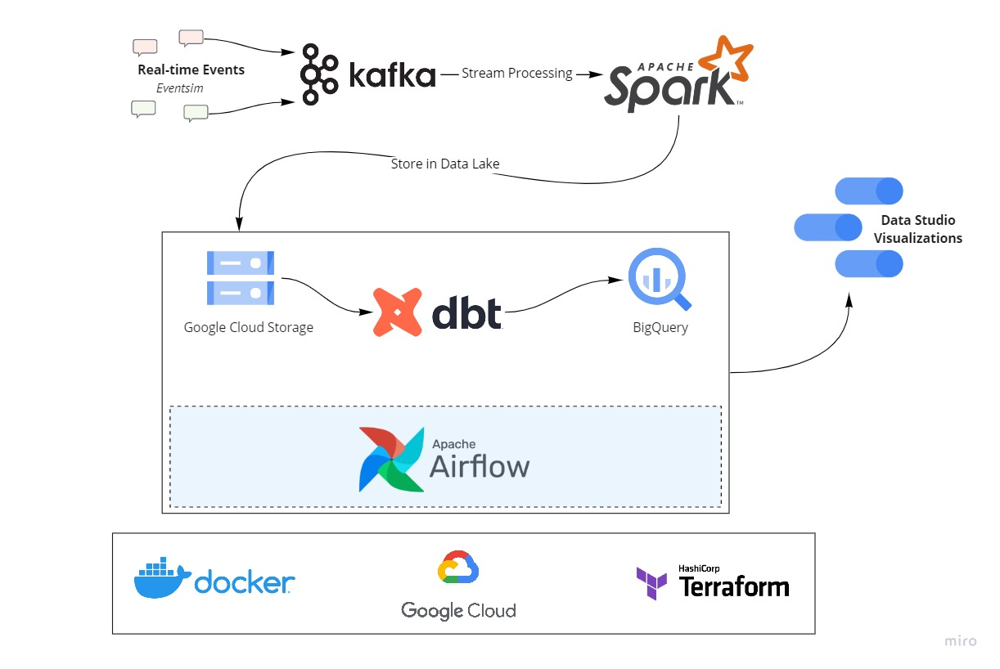

# Music Streaming Data Pipeline

A real-time data pipeline for music streaming analytics using modern data engineering tools.

## Overview

This project simulates a music streaming service (like Spotify) with real-time event processing. It captures user interactions (listening, navigation, authentication) and transforms them into actionable insights.

### Key Features
- Real-time event processing (2-minute intervals)
- Hourly batch analytics
- User behavior tracking
- Popular content analysis
- User demographics insights
- Data quality monitoring
- Automated testing
- CI/CD integration

## Tech Stack

- **Cloud**: Google Cloud Platform
- **Streaming**: Kafka + Spark Streaming
- **Orchestration**: Airflow
- **Transformation**: dbt
- **Storage**: GCS (Data Lake) + BigQuery (Data Warehouse)
- **Infrastructure**: Terraform + Docker
- **Visualization**: Data Studio
- **Testing**: Great Expectations
- **CI/CD**: GitHub Actions

## Quick Start

1. **Prerequisites**
   - GCP Account
   - Terraform
   - Docker
   - Python 3.8+

2. **Setup**
   ```bash
   # Clone repository
   git clone https://github.com/MOHAMED-EL-HADDIOUI/Music-Streaming-Data-Pipeline.git
   cd Music-Streaming-Data-Pipeline

   # Create and activate virtual environment
   python -m venv venv
   source venv/bin/activate  # On Windows: venv\Scripts\activate

   # Install dependencies
   pip install -r requirements.txt

   # Deploy infrastructure
   cd terraform
   terraform init
   terraform apply
   ```

3. **Configure Components**
   - [Kafka Setup](setup/kafka.md)
   - [Spark Setup](setup/spark.md)
   - [Airflow Setup](setup/airflow.md)

## Architecture



## Data Flow

1. **Event Generation**
   - Eventsim generates realistic user events
   - Data based on 10,000 songs from Million Songs Dataset
   - Event validation and quality checks

2. **Stream Processing**
   - Kafka ingests real-time events
   - Spark processes streams every 2 minutes
   - Data stored in GCS with partitioning
   - Real-time monitoring and alerting

3. **Batch Processing**
   - Airflow triggers hourly jobs
   - dbt transforms data with data quality tests
   - Results stored in BigQuery
   - Automated data quality checks

4. **Analytics**
   - Interactive dashboard visualizations
   - User behavior insights
   - Content popularity metrics
   - Real-time monitoring

## Documentation

- [Infrastructure Setup](setup/terraform.md)
- [Kafka Configuration](setup/kafka.md)
- [Spark Processing](setup/spark.md)
- [Airflow Workflows](setup/airflow.md)
- [Data Quality](setup/data_quality.md)
- [Troubleshooting](setup/debug.md)

## Project Structure

```
├── airflow/           # Airflow DAGs and configuration
├── dbt/              # Data transformation models
├── eventsim/         # Event simulation scripts
├── images/           # Project documentation images
├── kafka/            # Kafka configuration
├── scripts/          # Utility scripts
├── setup/            # Setup instructions
├── spark_streaming/  # Spark streaming jobs
└── terraform/        # Infrastructure as code
```

## Future Enhancements

- Managed services (Cloud Composer, Confluent Cloud)
- Custom VPC network
- Incremental processing
- Enhanced data quality tests
- CI/CD pipeline improvements
- Advanced visualizations
- Machine learning integration
- Real-time anomaly detection

## Contributing

1. Fork the repository
2. Create a feature branch
3. Commit your changes
4. Push to the branch
5. Create a Pull Request

## Acknowledgments

Inspired by [DataTalks.Club](https://datatalks.club) Data Engineering course.

## License

This project is licensed under the MIT License - see the LICENSE file for details.

## Repository

[https://github.com/MOHAMED-EL-HADDIOUI/Music-Streaming-Data-Pipeline](https://github.com/MOHAMED-EL-HADDIOUI/Music-Streaming-Data-Pipeline)